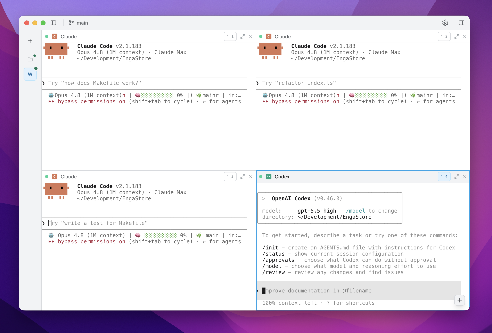

# Superior

A minimal desktop core. Open a local project folder and run agent CLIs
(`claude`, `codex`) inside it, with live output in an embedded, tabbed terminal.

## Preview



## Stack

Electron + React + TypeScript + Vite (`electron-vite`) + Tailwind CSS, with `node-pty`
for true-TTY process execution and `@xterm/xterm` for terminal rendering.

## Scripts

```bash
npm install     # installs deps and rebuilds node-pty against Electron (postinstall)
npm run dev     # launch the app in development (HMR)
npm run build   # type-check + build main/preload/renderer into out/
npm start       # preview the production build
npm run rebuild # manually rebuild node-pty if Electron is upgraded
```

## How it works

- **Open from folder** → native directory picker (main process). The chosen path is
  validated and persisted to `workspace.json` under the app's `userData` dir, then
  restored on next launch.
- **Open Claude / Open Codex** → spawns the CLI via a *login shell*
  (`$SHELL -l -c <cmd>`) with `cwd` set to the workspace, so your real `PATH`
  (e.g. `~/.local/bin`, nvm) is available even when launched from Finder.
- Each launched agent gets its own terminal tab; Claude and Codex can run concurrently.

## Layout

```
src/shared/types.ts          # Workspace, AgentType, AgentSession, IPC channels
src/main/                    # Electron main: services + IPC
  services/{workspace,agent,terminal}.service.ts
  ipc/{workspace,agent}.ipc.ts
src/preload/index.ts         # contextBridge -> window.api
src/renderer/src/            # React UI (TopBar, WorkspaceSelector, AgentButtons, TerminalPanel/View)
```
