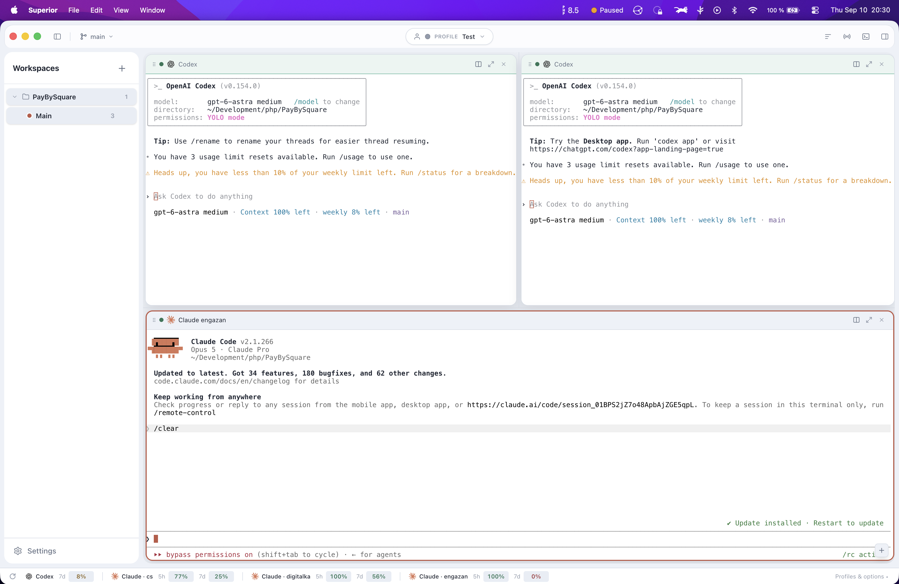

<div align="center">

# Superior

A minimal desktop core. Open a local or SSH-backed project folder and run agent CLIs (`claude`, `codex`) inside it, with live output in an embedded, tabbed terminal.

[](https://github.com/Engazan/superior/releases)
[](#license)


### ⬇️ [**Download the latest release**](https://github.com/Engazan/superior/releases)



</div>

## Install

### macOS

Release builds are **signed with a Developer ID and notarized by Apple**, so they open
with a normal double-click — no Gatekeeper warning.

If you ever hit *"Superior is damaged and can't be opened"* (only happens with an older,
unsigned build, or a download that kept its quarantine flag), strip the flag once from a
terminal:

```bash
xattr -dr com.apple.quarantine /Applications/Superior.app
```

### Windows

The Windows build is unsigned, so SmartScreen may warn on first run — choose
**More info → Run anyway**.

## Stack

Electron + React + TypeScript + Vite (`electron-vite`) + Tailwind CSS, with `node-pty`
for true-TTY process execution and `@xterm/xterm` for terminal rendering.

## Scripts

```bash
npm install      # installs dependencies (Node 22.12+)
npm run dev      # launch the app in development (HMR)
npm run build    # type-check + build main/preload/renderer into out/
npm start        # preview the production build
npm run rebuild  # manually rebuild node-pty if Electron is upgraded

npm run dist:mac    # package a macOS dmg/zip
npm run dist:win    # package a Windows nsis installer/zip
npm run dist:linux  # package a Linux AppImage/deb
```

Builds run per-platform on their native OS (CI uses a macOS/Windows/Linux matrix —
see `.github/workflows/ci.yml` and `release.yml`). `node-pty` is a native module, so packaging on
Windows needs the VS Build Tools + Python and Linux needs `build-essential` + `python3`.

## How it works

- **Open from folder** → native directory picker (main process). The chosen path is
  validated and persisted to `workspaces.json` under the app's `userData` dir, then
  restored on next launch.
- **Remote SSH workspace** → stores an SSH host/alias plus remote path and launches
  terminals through the system `ssh` client in that directory. Credentials, keys
  and passphrases stay owned by your normal SSH config/agent.
- **Open Claude / Open Codex** → spawns the CLI through the host shell with `cwd`
  set to the workspace. On macOS/Linux that's a *login shell* (`$SHELL -l -c <cmd>`,
  falling back to `/bin/bash`) so your real `PATH` (e.g. `~/.local/bin`, nvm) is
  available even when launched from Finder; on Windows it's `cmd.exe /c <cmd>`
  (and a plain terminal opens PowerShell).
- Each launched agent gets its own terminal tab; Claude and Codex can run concurrently.

## Layout

```
src/shared/                  # domain types, typed IPC contract, daemon protocol
src/main/                    # Electron main process: services + IPC handlers
src/daemon/                  # persistent PTY process and scrollback buffer
src/preload/index.ts         # explicit contextBridge capabilities
src/renderer/src/            # React UI, hooks, terminal and file/git views
```

## License

MIT
